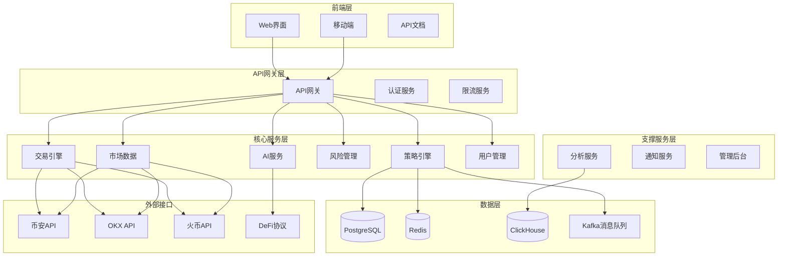

# 量化交易策略系统设计文档

## 概述

本文档描述了一个企业级加密货币量化交易平台的完整系统设计。该系统基于微服务架构，支持多种交易策略、AI驱动决策、实时风险管理、高频交易和DeFi集成等专业功能。

系统采用Rust作为后端核心语言，TypeScript/React作为前端技术栈，PostgreSQL作为主数据库，Redis作为缓存层，支持多交易所连接和实时数据处理。

## 架构设计

### 整体架构



### 微服务架构

#### 1. 策略引擎服务 (Strategy Engine)
- **端口**: 9001
- **职责**: 策略管理、信号生成、策略执行
- **核心模块**:
  - 策略工厂 (Strategy Factory)
  - 信号生成器 (Signal Generator)
  - 策略执行器 (Strategy Executor)
  - 回测引擎 (Backtest Engine)

#### 2. 交易引擎服务 (Trading Engine)
- **端口**: 8082
- **职责**: 订单管理、交易执行、仓位管理
- **核心模块**:
  - 订单管理器 (Order Manager)
  - 执行算法 (Execution Algorithms)
  - 仓位管理器 (Position Manager)
  - 交易所连接器 (Exchange Connectors)

#### 3. AI服务 (AI Service)
- **端口**: 8088
- **职责**: AI模型推理、价格预测、智能分析
- **核心模块**:
  - 模型管理器 (Model Manager)
  - 预测引擎 (Prediction Engine)
  - 对话助手 (Chat Assistant)
  - 机器学习训练 (ML Training)

#### 4. 风险管理服务 (Risk Management)
- **端口**: 8084
- **职责**: 实时风控、风险监控、合规检查
- **核心模块**:
  - 实时风控 (Real-time Risk Control)
  - 风险计算器 (Risk Calculator)
  - 合规检查器 (Compliance Checker)
  - 报警系统 (Alert System)

#### 5. 市场数据服务 (Market Data)
- **端口**: 8081
- **职责**: 数据采集、数据处理、数据分发
- **核心模块**:
  - 数据采集器 (Data Collector)
  - 数据处理器 (Data Processor)
  - 数据分发器 (Data Distributor)
  - 历史数据管理 (Historical Data Manager)

## 组件和接口

### 策略引擎组件

#### 策略基础接口
```rust
pub trait Strategy {
    fn initialize(&mut self, config: StrategyConfig) -> Result<()>;
    fn on_market_data(&mut self, data: MarketData) -> Result<Vec<Signal>>;
    fn on_order_update(&mut self, update: OrderUpdate) -> Result<()>;
    fn get_positions(&self) -> Vec<Position>;
    fn get_performance(&self) -> PerformanceMetrics;
}
```

#### 信号生成接口
```rust
pub trait SignalGenerator {
    fn generate_signals(&self, data: &MarketData) -> Result<Vec<TradingSignal>>;
    fn aggregate_signals(&self, signals: Vec<TradingSignal>) -> Result<TradingSignal>;
    fn validate_signal(&self, signal: &TradingSignal) -> Result<bool>;
}
```

#### 策略类型定义
```rust
#[derive(Debug, Clone, Serialize, Deserialize)]
pub enum StrategyType {
    TrendFollowing(TrendConfig),
    MeanReversion(MeanReversionConfig),
    GridTrading(GridConfig),
    Arbitrage(ArbitrageConfig),
    AIStrategy(AIConfig),
    MarketMaking(MarketMakingConfig),
    HighFrequency(HFConfig),
}
```

### AI服务组件

#### AI模型接口
```rust
pub trait AIModel {
    fn predict(&self, input: &MarketData) -> Result<PredictionResult>;
    fn get_confidence(&self) -> f64;
    fn update_model(&mut self, training_data: &[TrainingData]) -> Result<()>;
    fn get_model_info(&self) -> ModelInfo;
}
```

#### 支持的AI模型
```rust
#[derive(Debug, Clone)]
pub enum AIModelType {
    DeepSeekV2,
    GPT4Turbo,
    Claude35,
    GeminiPro,
    CustomModel(String),
}
```

### 风险管理组件

#### 风险控制接口
```rust
pub trait RiskController {
    fn check_pre_trade(&self, order: &Order) -> Result<RiskCheckResult>;
    fn check_position_risk(&self, positions: &[Position]) -> Result<RiskMetrics>;
    fn check_portfolio_risk(&self, portfolio: &Portfolio) -> Result<PortfolioRisk>;
    fn handle_risk_event(&mut self, event: RiskEvent) -> Result<Vec<RiskAction>>;
}
```

#### 风险指标
```rust
#[derive(Debug, Clone, Serialize, Deserialize)]
pub struct RiskMetrics {
    pub var_95: f64,           // 95% VaR
    pub max_drawdown: f64,     // 最大回撤
    pub sharpe_ratio: f64,     // 夏普比率
    pub volatility: f64,       // 波动率
    pub portfolio_risk: f64,   // 组合风险
    pub concentration_risk: f64, // 集中度风险
}
```

## 数据模型

### 核心数据结构

#### 市场数据模型
```rust
#[derive(Debug, Clone, Serialize, Deserialize)]
pub struct MarketData {
    pub symbol: String,
    pub timestamp: DateTime<Utc>,
    pub price: Decimal,
    pub volume: Decimal,
    pub bid: Decimal,
    pub ask: Decimal,
    pub high_24h: Decimal,
    pub low_24h: Decimal,
    pub change_24h: Decimal,
}

#[derive(Debug, Clone, Serialize, Deserialize)]
pub struct KlineData {
    pub symbol: String,
    pub interval: String,
    pub open_time: DateTime<Utc>,
    pub close_time: DateTime<Utc>,
    pub open: Decimal,
    pub high: Decimal,
    pub low: Decimal,
    pub close: Decimal,
    pub volume: Decimal,
    pub quote_volume: Decimal,
}
```

#### 交易数据模型
```rust
#[derive(Debug, Clone, Serialize, Deserialize)]
pub struct Order {
    pub id: Uuid,
    pub user_id: Uuid,
    pub strategy_id: Option<Uuid>,
    pub symbol: String,
    pub side: OrderSide,
    pub order_type: OrderType,
    pub quantity: Decimal,
    pub price: Option<Decimal>,
    pub status: OrderStatus,
    pub created_at: DateTime<Utc>,
    pub updated_at: DateTime<Utc>,
}

#[derive(Debug, Clone, Serialize, Deserialize)]
pub struct Position {
    pub id: Uuid,
    pub user_id: Uuid,
    pub symbol: String,
    pub side: PositionSide,
    pub size: Decimal,
    pub entry_price: Decimal,
    pub mark_price: Decimal,
    pub unrealized_pnl: Decimal,
    pub realized_pnl: Decimal,
    pub margin: Decimal,
    pub leverage: f64,
}
```

#### 策略数据模型
```rust
#[derive(Debug, Clone, Serialize, Deserialize)]
pub struct Strategy {
    pub id: Uuid,
    pub user_id: Uuid,
    pub name: String,
    pub strategy_type: StrategyType,
    pub symbols: Vec<String>,
    pub timeframes: Vec<TimeFrame>,
    pub parameters: StrategyParameters,
    pub status: StrategyStatus,
    pub performance: PerformanceMetrics,
    pub created_at: DateTime<Utc>,
    pub updated_at: DateTime<Utc>,
}

#[derive(Debug, Clone, Serialize, Deserialize)]
pub struct PerformanceMetrics {
    pub total_return: Decimal,
    pub annualized_return: Decimal,
    pub max_drawdown: Decimal,
    pub sharpe_ratio: f64,
    pub win_rate: f64,
    pub profit_factor: f64,
    pub total_trades: u64,
    pub winning_trades: u64,
    pub losing_trades: u64,
}
```

### 数据库设计

#### 核心表结构
```sql
-- 用户表
CREATE TABLE users (
    id UUID PRIMARY KEY DEFAULT gen_random_uuid(),
    username VARCHAR(50) UNIQUE NOT NULL,
    email VARCHAR(100) UNIQUE NOT NULL,
    password_hash VARCHAR(255) NOT NULL,
    api_key VARCHAR(255),
    api_secret VARCHAR(255),
    risk_level VARCHAR(20) DEFAULT 'MEDIUM',
    max_position_size DECIMAL(20,8) DEFAULT 10000,
    created_at TIMESTAMP WITH TIME ZONE DEFAULT NOW(),
    updated_at TIMESTAMP WITH TIME ZONE DEFAULT NOW()
);

-- 策略表
CREATE TABLE strategies (
    id UUID PRIMARY KEY DEFAULT gen_random_uuid(),
    user_id UUID NOT NULL REFERENCES users(id),
    name VARCHAR(100) NOT NULL,
    strategy_type VARCHAR(50) NOT NULL,
    symbols TEXT[] NOT NULL,
    timeframes TEXT[] NOT NULL,
    parameters JSONB NOT NULL,
    status VARCHAR(20) DEFAULT 'INACTIVE',
    performance JSONB,
    created_at TIMESTAMP WITH TIME ZONE DEFAULT NOW(),
    updated_at TIMESTAMP WITH TIME ZONE DEFAULT NOW()
);

-- 订单表
CREATE TABLE orders (
    id UUID PRIMARY KEY DEFAULT gen_random_uuid(),
    user_id UUID NOT NULL REFERENCES users(id),
    strategy_id UUID REFERENCES strategies(id),
    symbol VARCHAR(20) NOT NULL,
    side VARCHAR(10) NOT NULL,
    order_type VARCHAR(20) NOT NULL,
    quantity DECIMAL(20,8) NOT NULL,
    price DECIMAL(20,8),
    filled_quantity DECIMAL(20,8) DEFAULT 0,
    status VARCHAR(20) DEFAULT 'PENDING',
    exchange VARCHAR(20) NOT NULL,
    exchange_order_id VARCHAR(100),
    created_at TIMESTAMP WITH TIME ZONE DEFAULT NOW(),
    updated_at TIMESTAMP WITH TIME ZONE DEFAULT NOW()
);

-- 持仓表
CREATE TABLE positions (
    id UUID PRIMARY KEY DEFAULT gen_random_uuid(),
    user_id UUID NOT NULL REFERENCES users(id),
    symbol VARCHAR(20) NOT NULL,
    side VARCHAR(10) NOT NULL,
    size DECIMAL(20,8) NOT NULL,
    entry_price DECIMAL(20,8) NOT NULL,
    mark_price DECIMAL(20,8) NOT NULL,
    unrealized_pnl DECIMAL(20,8) DEFAULT 0,
    realized_pnl DECIMAL(20,8) DEFAULT 0,
    margin DECIMAL(20,8) DEFAULT 0,
    leverage DECIMAL(5,2) DEFAULT 1.0,
    exchange VARCHAR(20) NOT NULL,
    created_at TIMESTAMP WITH TIME ZONE DEFAULT NOW(),
    updated_at TIMESTAMP WITH TIME ZONE DEFAULT NOW(),
    UNIQUE(user_id, symbol, side, exchange)
);
```

## 正确性属性

*属性是一个特征或行为，应该在系统的所有有效执行中保持为真——本质上是关于系统应该做什么的正式声明。属性作为人类可读规范和机器可验证正确性保证之间的桥梁。*

基于预工作分析，以下是系统的核心正确性属性：

### 属性 1: 移动平均线突破信号生成
*对于任何* 价格序列和移动平均线参数，当价格从下方突破移动平均线时，策略引擎应该生成买入信号
**验证: 需求 1.1**

### 属性 2: MACD信号交叉检测
*对于任何* MACD线和信号线数据，当MACD线上穿信号线时，信号生成器应该发出看涨信号
**验证: 需求 1.2**

### 属性 3: RSI超买警告
*对于任何* RSI指标值，当RSI超过70时，风险管理器应该发出超买警告
**验证: 需求 1.3**

### 属性 4: 布林带均值回归信号
*对于任何* 价格和布林带数据，当价格偏离布林带上轨时应生成卖出信号，偏离下轨时应生成买入信号
**验证: 需求 2.1, 2.2**

### 属性 5: 网格交易执行
*对于任何* 网格参数和价格数据，当价格触及网格买入点时应执行买入订单，触及卖出点时应执行卖出订单
**验证: 需求 3.1**

### 属性 6: 套利机会检测
*对于任何* 现货和合约价格数据，当价差超过设定阈值时，策略引擎应该执行套利交易
**验证: 需求 4.1**

### 属性 7: AI预测信号生成
*对于任何* AI模型预测结果，当预测价格上涨且置信度超过阈值时，AI服务应该生成买入建议
**验证: 需求 5.1**

### 属性 8: 风险控制强制平仓
*对于任何* 交易和风险参数，当单笔亏损超过设定限额时，风险管理器应该强制平仓
**验证: 需求 6.1**

### 属性 9: 回测引擎完整性
*对于任何* 历史数据和策略参数，回测引擎应该执行完整的回测并生成性能报告
**验证: 需求 7.1**

### 属性 10: 高频交易延迟保证
*对于任何* 市场数据更新，策略引擎应该在1毫秒内处理并生成交易信号
**验证: 需求 21.1**

### 属性 11: 做市商价差调整
*对于任何* 订单簿数据，当订单簿不平衡时，策略引擎应该调整买卖价差以维持做市
**验证: 需求 22.1**

### 属性 12: 机器学习数据处理
*对于任何* 输入的训练数据，机器学习服务应该自动执行数据清洗和特征工程
**验证: 需求 28.1**

### 属性 13: 异常交易检测
*对于任何* 交易模式，当检测到异常时，风控系统应该实时标记并阻止相关交易
**验证: 需求 29.1**

## 错误处理

### 错误分类和处理策略

#### 1. 系统级错误
- **网络连接错误**: 自动重连机制，最多重试3次
- **数据库连接错误**: 连接池管理，故障转移到备用数据库
- **服务不可用**: 熔断器模式，降级服务

#### 2. 业务级错误
- **交易所API错误**: 错误码映射，自动重试或切换交易所
- **资金不足**: 拒绝交易，发送通知
- **风险超限**: 强制平仓，记录风险事件

#### 3. 数据级错误
- **数据格式错误**: 数据验证，丢弃无效数据
- **数据延迟**: 超时处理，使用缓存数据
- **数据缺失**: 插值处理或跳过处理

### 错误恢复机制

```rust
#[derive(Debug, Clone)]
pub enum SystemError {
    NetworkError(String),
    DatabaseError(String),
    ExchangeError(String),
    ValidationError(String),
    RiskError(String),
}

pub trait ErrorHandler {
    fn handle_error(&self, error: SystemError) -> Result<RecoveryAction>;
    fn log_error(&self, error: &SystemError);
    fn notify_error(&self, error: &SystemError);
}

#[derive(Debug, Clone)]
pub enum RecoveryAction {
    Retry(u32),
    Fallback(String),
    Shutdown,
    Ignore,
}
```

## 测试策略

### 双重测试方法

我们采用单元测试和基于属性的测试相结合的方法：

#### 单元测试
- 验证具体示例和边界情况
- 测试集成点和错误条件
- 专注于特定功能的正确性

#### 基于属性的测试
- 验证通用属性在所有输入中的正确性
- 通过随机化实现全面的输入覆盖
- 每个属性测试运行最少100次迭代

### 测试配置

#### 属性测试标签格式
每个属性测试必须使用以下标签格式引用设计文档属性：
**Feature: quantitative-trading-strategies, Property {number}: {property_text}**

#### 测试框架选择
- **Rust**: 使用 `proptest` 进行基于属性的测试
- **TypeScript**: 使用 `fast-check` 进行前端属性测试
- **集成测试**: 使用 `testcontainers` 进行数据库和外部服务测试

### 测试覆盖范围

#### 核心策略测试
- 趋势跟踪策略的信号生成准确性
- 均值回归策略的买卖点识别
- 网格交易的订单执行逻辑
- 套利策略的价差计算

#### AI服务测试
- 多模型预测结果一致性
- 置信度计算准确性
- 对话助手响应质量
- 模型切换和故障转移

#### 风险管理测试
- 实时风控规则执行
- 风险指标计算准确性
- 强制平仓触发条件
- 合规检查完整性

#### 性能测试
- 高频交易延迟测试
- 并发处理能力测试
- 数据库查询性能测试
- 内存使用优化测试

### 测试数据管理

#### 历史数据
- 使用真实的历史市场数据进行回测
- 包含各种市场条件：牛市、熊市、震荡市
- 数据时间跨度至少覆盖2年

#### 模拟数据
- 生成符合市场特征的随机数据
- 包含极端情况和边界条件
- 支持多种资产类型和时间框架

#### 测试环境
- 独立的测试数据库
- 模拟的交易所API
- 隔离的缓存和消息队列